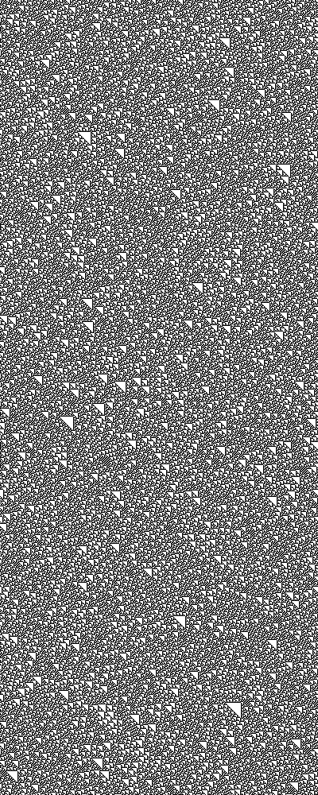

# automatoElementarDeWolfram
<!-- Um programa que simula um automato elementar de wolfram, onde é possível escolher uma regra para ser executada entre as 256 possíveis. -->

Wolfram analisou como sistemas deterministas simples podiam apresentar um comportamento complexo, começou seus estudos pelos automatos celulares elementades.

**Definição:** 
Um automato celular é dito elementar se:
> for unidimensional

> suas células assumem um entre dois valores

> vizinhança só contem três vizinhos, a célula que encontra à esquerda, à direita e a própria célula.

**Regra de Transição**

Considerando um Automato Celular Elementar, e denotando por C_i(T) o estado da célula i em um momento T.

Podemos escrever que o estado de uma célula em um instante T+1 é obtido a partir dos estados de suas células vizinhas no instante anterior

**C_i(T+1) = phi(vizinhança) = phi(C_i-1(T), C_i(T), C_i+1(T))**
>onde phi é uma função booleana de três variáveis

**Execução**

Dado a configuração inicial do automato e uma regra de transição phi, podemos fazer transições para acompanhar a dinâmica que um sistema regido por esta regra (phi) exibe.

A cada transição empilhamos o resultado do autômato e então gearmos uma imagem, assim podemos acompanhar a evolução do sistema.

A seguinte imagem mostra a execução da regra 30:

